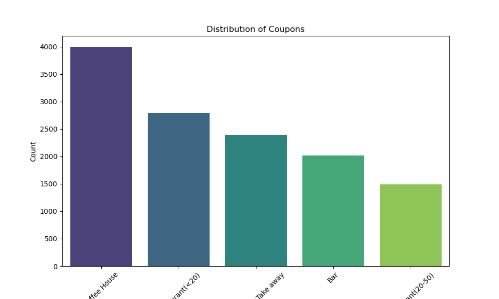
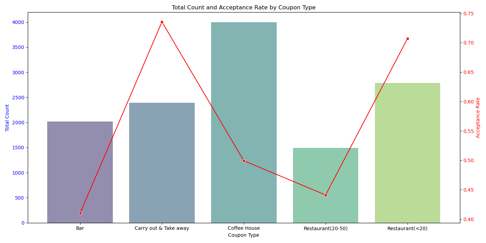
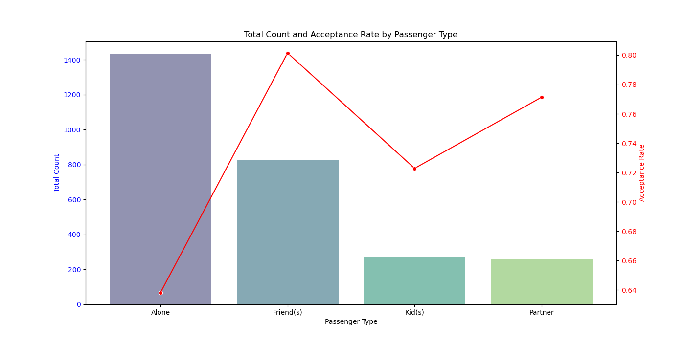
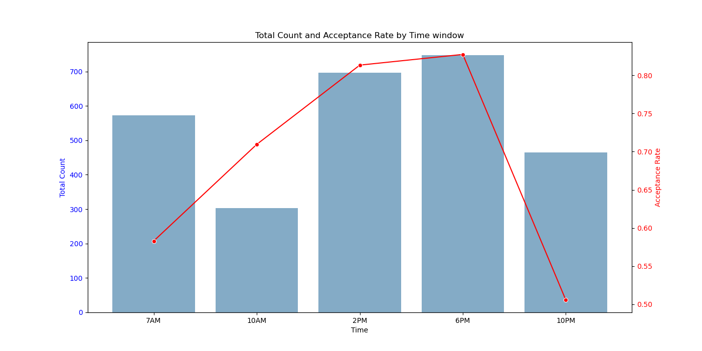
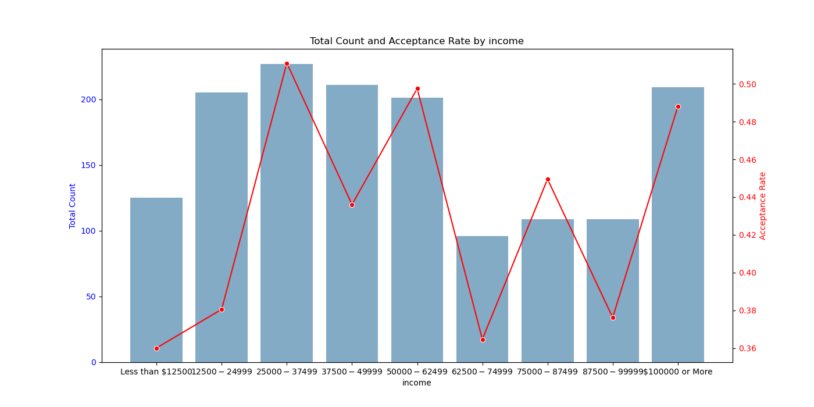

# MLAI-MOD5-PAA-01
## Module 5 Practical Application Assignment - 01

# Driving Coupon Acceptance Analysis

## Overview

The purpose of this report is to analyze and identify the factors that influence a driver's decision to accept coupons delivered to their cell phones while driving.

## Data Description

The dataset includes attributes divided into user attributes, contextual attributes, and coupon attributes:

- **User Attributes:**
  - Gender: male, female
  - Age: below 21, 21 to 25, 26 to 30, etc.
  - Marital Status: single, married partner, unmarried partner, widowed
  - Number of children: 0, 1, more than 1
  - Education: high school, bachelor's degree, associate degree, graduate degree
  - Occupation: architecture & engineering, business & financial, etc.
  - Annual income: less than $12,500, $12,500 - $24,999, $25,000 - $37,499, etc.
  - Frequency of visits to bars, coffee houses, takeaway food places, and inexpensive restaurants

- **Contextual Attributes:**
  - Driving destination: home, work, no urgent destination
  - Location of user, coupon, and destination
  - Weather: sunny, rainy, snowy
  - Temperature: 30°F, 55°F, 80°F
  - Time: 10 AM, 2 PM, 6 PM
  - Passenger: alone, partner, kids, friends

- **Coupon Attributes:**
  - Time before it expires: 2 hours, one day

## Key Findings
See Jupyter notebook for detailed analysis: [Data Analysis Report](prompt.ipynb)

### Distribution of Coupons

To analyze the distribution of the "coupon" column within the dataset, it is recommended to employ a bar plot. This visualization technique effectively illustrates the frequency of each unique value present in the "coupon" column, providing a clear and concise representation of the data. By plotting the counts of each coupon type, one can easily discern patterns and draw insights regarding the prevalence of different coupons.

With nearly 4,000 coffee house coupons issued, this dataset provides a robust foundation for analysis. Restaurant and carryout coupons also have a good amount of data to analyze. In contrast, the limited number of high-end restaurant coupons restricts our ability to draw meaningful conclusions about their acceptance rate.

### Proportion of Accepted Coupons

- The overall acceptance rate for coupons is 56.84%.

Let's see the distribution of the acceptance rate among different coupon types.

The plot indicates that approximately 4,000 drivers received coffee house coupons, with a corresponding acceptance rate of roughly 50%. In contrast, carryout and takeaway coupons exhibited a higher acceptance rate of 73%, while less expensive restaurant coupons demonstrated a 70% acceptance rate. A more in-depth analysis of the less expensive restaurant dataset would be beneficial. We can also explore the bar coupons.

### Analyzing the Bar Coupons in the Dataset

#### What Proportion of Bar Coupons Were Accepted?

Proportion of accepted bar coupons: 0.41, meaning about 41% of drivers accepted the bar coupons.

#### What is the Difference Between the Drivers Who Accepted the Bar Coupons and Those Who Did Not?

**Frequency of Bar Visits**

- Acceptance rate for those who went to a bar 3 times or fewer: 37.06%
- Acceptance rate for those who went to a bar more than 3 times: 73.18%

**Conclusion**: This finding is quite interesting! It suggests a strong correlation between the frequency of bar visits and the likelihood of accepting a bar-related coupon.

#### Other Attributes We Can Analyze

- Acceptance rate for drivers who go to a bar more than once a month and are over the age of 25: 68.46%
- Acceptance rate for all other drivers: 34.81%

Drivers who go to a bar more than once a month and are over the age of 25 have a higher acceptance rate.

**Conclusion**: Drivers who go to bars at least once a month are more likely to accept bar coupons.

#### Does Having Passengers Make a Difference?

- Acceptance rate for drivers who go to a bar more than once a month and travel without kids and do not work in farming, etc.: 70.30%
- Acceptance rate for all other drivers: 29.49%

Drivers who go to a bar more than once a month and travel without kids have a higher acceptance rate.

**Conclusion**: Drivers who go to a bar more than once a month and travel without kids have a higher acceptance rate.

- Drivers traveling without kids and who go to bars frequently show an even higher acceptance rate.

#### Specific Conditions for Higher Acceptance Rates

Drivers satisfying any of the following conditions have a higher acceptance rate of 61.03%:

1. Visit bars more than once a month, have passengers that are not kids, and are not widowed.
2. Visit bars more than once a month and are under the age of 30.
3. Visit inexpensive restaurants more than four times a month and have an annual income of less than $50,000.

Drivers who satisfy one of these conditions have an acceptance rate of 61.03%. Drivers who do not satisfy any of these conditions have an acceptance rate of 29.42%.

**Conclusion**: Based on the analysis, there is a correlation between a driver's acceptance of bar coupons and certain attributes. This indicates a preference or potential interest in bar-related establishments, frequent bar visits, and the absence of children as passengers.

## Detailed Analyses on Less Expensive Restaurant Coupons

### What is the Acceptance Ratio of Drivers by Age?

Group the drivers by age and calculate the acceptance ratio.

**Conclusion**: Based on the above data set, there appears to be a weak negative correlation between driver age and coupon acceptance rate. Younger drivers (under 30) tend to have slightly higher acceptance rates compared to older drivers (above 50). There is no strong correlation between driver age and coupon acceptance rate.

### Let's See if Driver's Gender, Marital Status, or Parental Status Has Any Impact on the Acceptance Ratio

**Acceptance Ratio by Gender:**
| Gender | Acceptance Ratio |
|--------|-------------------|
| Female | 0.696692          |
| Male   | 0.717949          |

**Acceptance Ratio by Parental Status:**
| Has Children | Acceptance Ratio |
|--------------|-------------------|
| 0            | 0.714548          |
| 1            | 0.696522          |

**Acceptance Ratio by Marital Status:**
| Marital Status     | Acceptance Ratio |
|--------------------|-------------------|
| Divorced           | 0.633333          |
| Married partner    | 0.689902          |
| Single             | 0.729885          |
| Unmarried partner  | 0.725738          |
| Widowed            | 0.551724          |

**Conclusion**: There is no discernible difference in coupon acceptance rates based on driver gender, marital status, or parental status. We will explore other attributes, such as passenger demographics, for potential correlations.

### Group the Drivers by Passenger and Calculate the Acceptance Ratio for Each Group

| Passenger   | Count | Accepted | Acceptance Rate |
|-------------|-------|----------|-----------------|
| Alone       | 1435  | 916      | 0.638328        |
| Friend(s)   | 826   | 662      | 0.801453        |
| Kid(s)      | 267   | 193      | 0.722846        |
| Partner     | 258   | 199      | 0.771318        |

**Conclusion**: Drivers who are traveling with friends are most likely to accept the coupon.

### Let's See if the Time of Day Matters in Accepting the Restaurant Coupons

**Conclusion**: Drivers are more likely to accept restaurant coupons when they are received between 10 AM and 6 PM. The acceptance rate is particularly high during the afternoon hours of 2 PM to 6 PM.

Let's determine when drivers traveling with friends are most likely to accept coupons.

**Conclusion**: The optimal time to distribute less expensive restaurant coupons, maximizing acceptance rates, appears to be between 10 AM and 6 PM.

### Summary

Less expensive restaurant coupons distributed to drivers accompanied by friends or partners between the hours of 10 AM and 6 PM demonstrate a higher probability of acceptance.

### Let's Explore the Expensive Restaurant Data

Based on our previous visualization, high-end restaurants have an acceptance ratio of 44%. Let's dive deeper.

#### Does Income Have Any Influence on Accepting the High-End Restaurant Coupons?

**Observation**: Based on the data analysis, income does not have any significant impact on the acceptance ratio for high-end restaurant coupons.

#### Do Drivers Who Frequently Go to High-End Restaurants Have Any Influence on Accepting the Coupons?

**Observation**: Those who frequently go to high-end restaurants have a higher chance of accepting the coupons.

**Observation**: Drivers who are traveling with their partners tend to be more likely to accept coupons for high-end restaurants.

**Summary**: Drivers who are traveling with their partners and frequently visit high-end restaurants have a high chance of accepting the coupons. The income of drivers does not have any correlation to accepting the coupons.

## Next Steps
**Conduct Comprehensive Analysis of All Coupon Types**: Examine the remaining types of coupons to understand how different attributes affect their acceptance rates.
**Develop a Predictive Model**: Create a model using the analyzed data to predict coupon acceptance for each coupon type or based on the attributes predicts which coupon is a good fit for the driver. This way we can promote the business to the right target of customers.
**Validate the Model**: Test the model's accuracy and reliability using a separate test dataset.